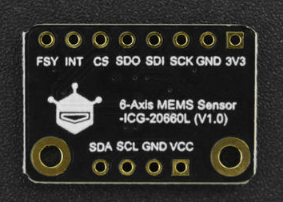

# DFRobot_GP8302

- [English Version](./README.md)

这是一款IIC转0 ~ 25mA DAC模块。用户可以通过控制此模块输出0 ~ 25mA的电流，它具有以下特点：
1. 需接外部电源，范围：18 ~ 24V, 18V供电最大450R负载能力，24V供电最大650R。
2. 能控制模块输出0 ~ 25mA范围内的直流电流。
3. 采用I2C接口控制输出电流的大小，I2C默认地址为0x58。
4. 模块掉电后，输出电流配置将丢失，如果想下次上电采用此次配置，需保存配置。

 


## 产品链接（[www.dfrobot.com](www.dfrobot.com)）
    SKU: DFR0972 

## 目录

  * [概述](#概述)
  * [库安装](#库安装)
  * [方法](#方法)
  * [兼容性](#兼容性)
  * [历史](#历史)
  * [创作者](#创作者)

## 概述

提供一个Arduino库给IIC转0~25mA DAC模块，以设置和保存该模块输出的电流配置，此库具有以下功能：
1. 直接设置0 ~ 25mA的输出电流；
2. 通过设置DAC范围0 ~ 0xFFF来输出对应的电流；
3. 保存电流配置，掉电后，该配置不丢失。

## 库安装
1. 下载库至树莓派，要使用这个库，首先要将库下载到Raspberry Pi，命令下载方法如下:<br>
```python
sudo git clone https://github.com/DFRobot/DFRobot_GP8302
```
2. 打开并运行例程，要执行一个例程demo_x.py，请在命令行中输入python demo_x.py。例如，要执行 demo_set_current.py例程，你需要输入:<br>

```python
python demo_set_current.py 
或 
python2 demo_set_current.py 
或 
python3 demo_set_current.py
```

## 方法

```python
  '''!
    @brief   I2C转电流DAC模块所连接的MCU的I2C引脚重映射，并初始化该模块。
    @param scl  树莓派的IO口引脚
    @param sda  树莓派的IO口引脚
    @return  初始化状态值
    @retval  0    初始化成功
    @retval  1    I2C转电流DAC模块所连接的MCU的I2C引脚无效
    @retval  2    设备未找到，请检查连线是否正确
  '''
  def begin(self, scl = -1, sda = -1):

  '''!
    @brief   校准4~20mA范围内的电流
    @param dac_4   范围0~0xFFF，超过校准无效，4mA电流对应的DAC值， 一般在655数值左右上下浮动，实际值需要用户在实际应用场景中测试4mA电流对应的DAC值
    @param dac_20  范围0~0xFFF，超过校准无效，20mA电流对应的DAC值，一般在3277数值左右上下浮动，实际值需要用户在实际应用场景中测试20mA电流对应的DAC值
    @note 用户在实际场景中校准4mA对应电流的方法：使用output_mA(uint16_t dac)函数，传入的dac参数在655数值上下左右浮动，用仪表检测输入那个DAC值时，测得的电流值为4mA即可
    @n 20mA电流对应DAC的获取方法：使用output_mA(uint16_t dac)函数，传入的dac参数在3277数值上下左右浮动，用仪表检测输入那个DAC值时，测得的电流值为20mA即可
    @note 参数dac_4和dac_20应满足条件：dac_4 < dac_20，使能校准后，output函数将输出校准后的电流值
  '''
  def calibration4_20mA(self, dac_4 = 655, dac_20 = 3277):
    
  '''!
    @brief   设置DAC值，以控制电流端输出0~25mA的电流。
    @param dac  具体的DAC值，范围0~0xFFF
    @note DAC值得范围为0~0xFFF,0~0xFFF DAC值对应输出0~25mA的电流，DAC值转实际电流公式：Iout = (DAC/0xFFF)*25mA
    @return 实际电流值，单位mA
  '''
  def output_mA(self, dac):

  '''!
    @brief   设置DAC值，以控制电流端输出0~25mA的电流。
    @param current_mA  输出的电流值，范围：0~25mA
    @return 输出电流值所对应的DAC值
    @note calibration4_20mA 校准后，output函数将输出校准后的电流值，并返回校准后的DAC值
  '''
  def output(self, current_mA):

  '''!
    @brief   保存当前电流配置，保存成功后，模块掉电重启后，将启用此配置。
  '''
  def store(self):
    
```

## 兼容性

| 主板         | 通过 | 未通过 | 未测试 | 备注 |
| ------------ | :--: | :----: | :----: | :--: |
| RaspberryPi2 |      |        |   √    |      |
| RaspberryPi3 |      |        |   √    |      |
| RaspberryPi4 |  √   |        |        |      |

* Python 版本

| Python  | 通过 | 未通过 | 未测试 | 备注 |
| ------- | :--: | :----: | :----: | ---- |
| Python2 |  √   |        |        |      |
| Python3 |  √   |        |        |      |

## 历史

- 2022/03/03 - 1.0.0 版本

## 创作者

Written by Arya(xue.peng@dfrobot.com), 2022. (Welcome to our [website](https://www.dfrobot.com/))


